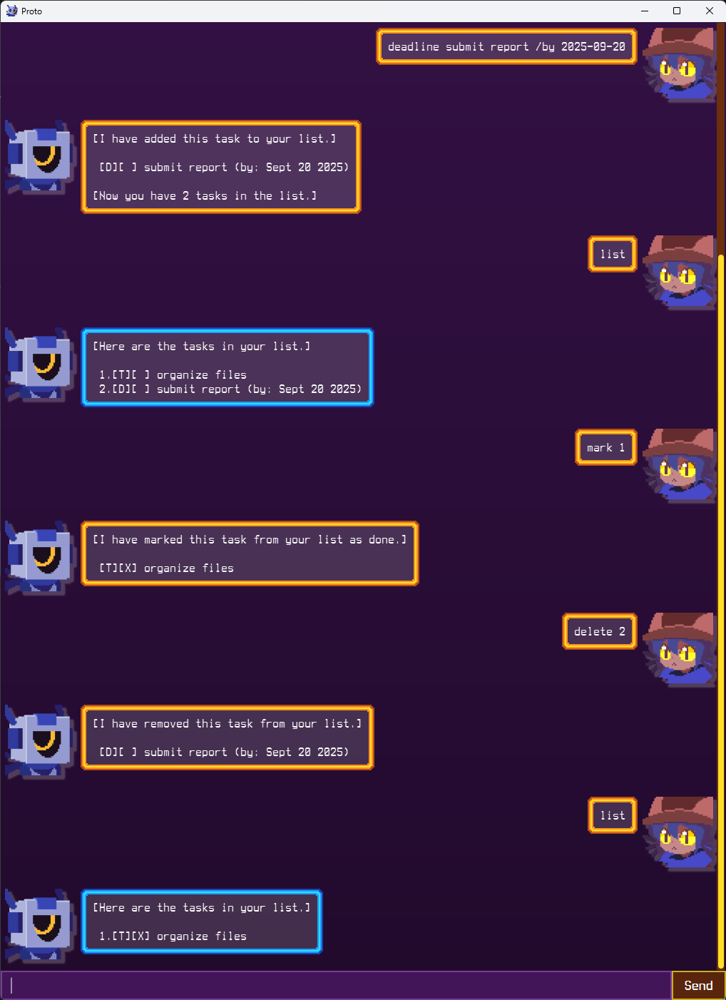

# Proto User Guide

Proto is a chatbot application that will help you manage your tasks and track which ones you have finished.

There are 3 types of tasks supported:
* `todo` - a simple task with just a description
* `deadline` - a task with a description and end date
* `event` - a task with a description and both a start and end date

Assets used are taken or based from the game OneShot.

## Setup

Note that you will need **Java 17 or later** to run the application.
* `proto.jar` can be downloaded from [Releases](https://github.com/AndrescuIII-too/ip/releases).
* To start the application, double-click the JAR file or run `java -jar proto.jar` in the terminal.
    * On first startup, this will create the directory `./data` containing `config.txt` and `tasks.txt`
    * Be careful when running the application from the terminal, as it will look for or setup `./data` from the current directory that it was launched from.

## Usage

### Adding tasks: `todo`, `deadline`, `event`
Add a todo/deadline/event task to the list with `todo`/`deadline`/`event` respectively, with the given `description` and `date`s if relevant.\
The `description` cannot be empty, and `date` must be in the format `YYYY-MM-DD`.

**Format:**
* `todo [description]`
* `deadline [description] /by [date]`
* `event [description] /from [start-date] /to [end-date]`

**Example Usage:**
* `todo organize files`
    * inserts a task displayed as `[T][ ] organize files`
* `deadline submit report /by 2025-09-20`
    * inserts a task displayed as `[D][ ] submit report (by: Sept 20 2025)`

### Viewing tasks: `list`, `find`
View all the tasks in your list using `list`.\
Alternatively, `find` can be used to filter tasks in the list which contain the given `query` within its description.

**Format:**
* `list`
* `find [query]`

### Deleting tasks: `delete`, `clear`
Delete tasks using `delete` with the given `index` (which can be found beside the task by using the command `list`).\
Alternatively, all tasks in the list can be deleted using `clear`.

**Format:**
* `delete [index]`
* `clear`

### Marking/Unmarking tasks: `mark`, `unmark`
Mark/Unmark tasks as done in the list using `mark`/`unmark` respectively with the given `index`.

Marked tasks are prefixed with `[_][X]` instead of `[_][ ]` when using `list`.

**Format:**
* `mark [index]`
* `unmark [index]`

### Load tasks from file: `load`
Choose to load and modify a different task list with `load` given the `save-path`.\
The file at the `save-path` must exist before using the command, and a new list can be created by using an empty file.\
Alternatively, the `save-path` can be manually changed by opening `./data/config.txt`.

Note that the default save file used is located at `./data/tasks.txt`.

**Format:** `load [save-path]`

### Other commands
`bye` - Exits the program.\
`help` - Shows a summary of all commands and their usages